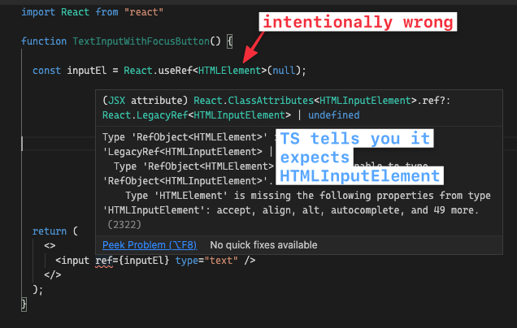

# Recomendações - React.js

<div class="alert alert--primary" role="alert">

   - **Revisado em:** 19/06/2024:15:02

</div>

---

### Na construção de UI, utilize a abordagem correta de acordo com cada contexto.

-  Você pode construir UI seguindo duas abordagens: "top down (wrapper -> componente)" ou "down top (component -> wrapper)".
   -  Em projetos mais simples, é mais facil ir de `wrapper -> component` -> (top down).
   -  Em projetos mais completox, é mais facil ir de `component -> wrapper` -> (down top).

### Existem dois caminhos comuns para descrever os filhos de um componente

- A primeira é usar o tipo `React.ReactNode`, que é uma união de todos os tipos possíveis que podem ser passados como filhos em JSX.

```js title="Exemplo"
interface ExampleNodeProps {
   children: React.ReactNode;
}

const Example: React.FC<ExampleNodeProps> = ({children}) => <>{children}</>;
```

- A segunda é usar o tipo `React.ReactElement`, que consiste apenas em elementos JSX e não em primitivos JavaScript como strings ou números.

```js title="Exemplo"
interface ExampleElementProps {
   children: React.ReactElement;
}

const ExampleElement: React.FC<ExampleElementProps> = ({children}) => <>{children}</>;

```

### Ao usar estilos inline no React, você pode usar o tipo `React.CSSProperties` para descrever o objeto passado para a prop style.

> Este tipo é uma união de todas as propriedades CSS possiveis e é uma boa maneira de garantir que você está passando propriedades CSS válidas para propriedade `style` e de obter o preenchimento automático em seu editor.

```js title="Exemplo"
interface ExampleProps {
   style: React.CSSProperties;
}

const Example: React.FC<ExampleProps> = (props) => <p style={{ background: props.style.background }}>{""}</p>;

```

### Mantenha os componentes puros

- Uma função pura:
   - **Cuida da própria vida**: ele não altera nenhum objeto ou variável que exista antes de ser chamado.
   - **Mesmas entradas, mesmas saídas**: dadas as mesmas entradas, uma função pura deve sempre retornar o mesmo resultado.

> **Resumindo**: um componente deverá ter apenas uma responsabilidade única ! 

### Evite alterar os nós DOM gerenciados pelo React 

- Utilize sempre declaração imperativa no lugar de declarativa. 
   - Ou seja, nunca manipule o DOM com `getElementByID` etc... sempre utilize estados e hooks do react.
- Evite alterar os nós DOM gerenciados pelo React. 
   - Modificar, adicionar filhos ou remover filhos de elementos gerenciados pelo React pode levar a resultados visuais inconsistentes ou travamentoss.

### Otimizações em estados

- Se você sempre atualiza dois ou mais estados ao mesmo tempo, considere transformá-los em um unico estado.
- Quando um estado receber por default um valor via props, utilize os nomes iniciais como initialProps ou defaultProps.

### Quando você precisar forçar a recriação de um componente da arvore, adicione uma `key` prop.

- O React destrói o estado quando remove um componente da árvore.
- Você pode forçar uma subárvore a redefinir seu estado fornecendo a ela uma chave diferente.

```js title="Exemplo"
const Example: React.FC<ExampleProps> = (props) => <div key={"nome-da-key"}>{""}</div>;
```

### use redutores se você encontrar bugs frequentemente devido a atualizações de estado incorretas em algum componente e quiser introduzir mais estrutura ao seu código.

- Tenha estas duas dicas em mente ao escrever redutores:
   - **os redutores devem ser puros:** 
      - Semelhante às funções de atualização de estado , os redutores são executados durante a renderização! (As ações são enfileiradas até a próxima renderização.) Isso significa que os redutores devem ser puros — as mesmas entradas sempre resultam na mesma saída. 
      - Eles não devem enviar solicitações, agendar tempos limite ou executar quaisquer efeitos colaterais (operações que afetem coisas fora do componente). 
      - Eles devem atualizar objetos e arrays sem mutações.

   - **Cada ação descreve uma única interação do usuário, mesmo que isso leve a diversas alterações nos dados**: 
      - Por exemplo, se um usuário pressionar “Redefinir” em um formulário com cinco campos gerenciados por um redutor, faz mais sentido despachar uma `reset_form` em vez de cinco `set_fiel` separadas.
      - Se você registrar todas as ações em um redutor, esse registro deverá ser claro o suficiente para você reconstruir quais interações ou respostas aconteceram e em que ordem. Isso ajuda na depuração!

```js title="Exemplo"
const initialTasks = [
  {id: 0, text: 'Visit Kafka Museum', done: true},
  {id: 1, text: 'Watch a puppet show', done: false},
  {id: 2, text: 'Lennon Wall pic', done: false},
];

export default function tasksReducer(tasks, action) {
   switch (action.type) {
     case 'added': {
       return [
         ...tasks,
         {
           id: action.id,
           text: action.text,
           done: false,
         },
       ];
     }  
     default: {
       throw Error('Unknown action: ' + action.type);
     }
   }
 } 

const Example: React.FC<ExampleProps> = (props) => {
   const [tasks, setTasks] = useReducer(tasksReducer, initialTask)

   const handleAddTask = useCallback(() => ({
      dispatch({
         type: 'added',
         id: nextId++,
         text: text,
       })
   }), []);   


   return <></>;   
};
```

### Quando você deseja que um componente "lembre" algumas informações, masnão deseja que essas informações acionem novas renderizações, você pode usar um ref.

- Se o seu componente precisa armazenar algum valor, mas isso não afeta a lógica de renderização, escolha refs.
- Uma ref é um objeto JavaScript simples com uma única propriedade chamada current, que você pode ler ou definir.
- Assim como o estado, as referências permitem reter informações entre as novas renderizações de um componente.
- Ao contrário do estado, definir o valor da referência current não aciona uma nova renderização.
- Observe que o componente não é renderizado novamente a cada incremento. Assim como o estado, as referências são retidas pelo React entre as novas renderizações. 
   - No entanto, definir o estado renderiza novamente um componente. Mudar uma referência não!
- Os valores das referências (useRef) permanecem entre as renderizações.
- Refs são como variáveis ​​de estado que não acionam novas renderizações quando você as define.
- Por padrão o React não permite que um componente acesse os nós DOM de outros componentes. 
   - Nem mesmo para seus próprios filhos! Isso é intencional. 
   - Refs são uma saída de emergência que deve ser usada com moderação. 
   - A manipulação manual dos nós DOM de outro componente torna seu código ainda mais frágil.
- Em vez disso, os componentes que desejam expor seus nós DOM precisam aceitar esse comportamento. 
- Um componente pode especificar que “encaminha” sua referência para um de seus filhos. Veja como MyInputusar a forwardRefAPI:
   - Em casos incomuns, você pode querer restringir a funcionalidade exposta. Você pode fazer isso com useImperativeHandle:

```js title="Exemplo"
interface ExampleForwardedRef {}

const ExampleForwarded: React.FowardRefRenderFunction<object, ExampleForwardedRef> = (props, ref) => {
   
useImperativeHandle(ref, () => ({}), []);

return <></>;
}

export default forwaredRef(ExampleForwarded);

const Example: React.FC = () => {

   const count = useRef(0);

   // forwaredRef
   const exampleForwardRef = useRef<ExampleForwardedRef>(null);

   return <>
            // Valor será 0 na view, porém no console será o valor incrementado.
            {count.current}

            <button onClick={() => (count.current = count.current + 1)}>Incrementar</button>
            <button onClick={() => console.log(count.current)}>Incrementar</button>

            // Uso do forwaredRef
            <ExampleForwarded ref={exampleForwardRef}/>
   </>;
}
```

### Utilize `useEffect` quando deve acontecer independentemente da interação que causou o aparecimento do componente.

- Utilize useEffect quando deve acontecer independentemente da interação que causou o aparecimento do componente.
- `useEffect` “atrasa” a execução de um trecho de código até que a renderização seja refletida na tela.

### Você pode forçar o React a atualizar o DOM de forma síncrona.

- No React, as atualizações de estado são enfileiradas. Normalmente, é isso que você deseja. Porém, aqui causa um problema porque setTodosnão atualiza imediatamente o DOM. 
   - Portanto, no momento em que você rola a lista até o último elemento, a tarefa ainda não foi adicionada. É por isso que a rolagem sempre “atrasa” um item.
- Para corrigir esse problema, você pode forçar o React a atualizar (“liberar”) o DOM de forma síncrona. 
   - Para fazer isso, importe flushSync do react-dom e envolva a atualização de estado em uma chamada flushSync:

```js title="Exemplo"
import { flushSync } from 'react-dom';

flushSync(() => {
  setSomething(123);
});
```

> Na maioria das vezes, flushSync pode ser evitado. Use flushSync como último recurso.

### Boas Praticas com `useEffect`

- `useEffect` geralmente devem sincronizar seus componentes com um sistema externo. 
   - Se não houver nenhum sistema externo e você quiser apenas ajustar algum estado com base em outro estado, talvez não seja necessário um `useEffect`.

> Você pode dizer ao React para **pular a execução desnecessária do useEffect** especificando um array de dependencias como o segundo argumento.

- A matriz de dependencias pode conter multiplas dependencias. 
- O React só irá pular a nova execução do `useEffect` se todas as dependencias que você especificar tiverem exatamente os mesmos valores que tinham durante a renderização anterior.
- O React compara os valores de dependencias usando a comparação `Object.is`.

```js title="Exemplo"
const [count, setCount] = useState(0);

// Não faça isso, isso irá produzir um loop infinito.
useEffect(() => {
   setCount(count + 1);
   });
```

```js title="Exemplo"
useEffect(() => {
   // Isto é executado depois de todas as renderizações.
 });
 
 useEffect(() => {

   // Especificar `isPlaying` como o array de dependencia diz ao React que ele deve pular a nova execução do seu Efeito se `isPlaying` 
   // for o mesmo que era durante a renderização anterior.
   },[isPlaying]);

 useEffect(() => {
   // Isto é executado na montagem (quando o componente aparece).
 }, []);
 
 useEffect(() => {
   // Isto é executado na montagem (quando o componente aparece) ou caso alguma das dependencias sejam modificadas.
 }, [a, b]);
```

#### Não precisa colocar ref como dependencia do useEffect

- Não precisa colocar `ref` como dependencia do useEffect, a não ser que seja passado via props de um componente pai.
   - Pois você não sabe se o pai está passando a mesma referencia, portando, coloque como dependencia do useEffect somente neste caso especifico:
      - Isso ocorre porque o refobjeto tem uma identidade estável: 
         - o React garante que você sempre obterá o mesmo objeto da mesma useRefchamada em cada renderização. 
         - Ele nunca muda, portanto, por si só, nunca fará com que o Efeito seja executado novamente. 
         - Portanto, não importa se você o inclui ou não. Incluir também está bem.

#### Retorne uma função de limpeza do seu `useEffect`

Retorne uma função de limpeza do seu `useEffect` quando necessário desconectar antes da nova renderização.

- Normalmente, a função de limpeza deve parar ou desfazer tudo o que o `useeffect` estava fazendo.
- O React chamará sua função de limpeza todas as vezes antes do `useEffect` ser executado novamente e uma última vez quando o componente for desmontado (removido). 
- Sempre limpe principalmente quando chamar api que retorne dados no useEffect, garanta que seja sempre limpo a cada nova execução.
   - Isso não apenas melhorará a experiência de desenvolvimento, mas também tornará seu aplicativo mais rápido.   

```js title="Exemplo"
useEffect(() => {
   const connection = createConnection();
   connection.connect();
   return () => {
     connection.disconnect();
   };
 }, []);
```

Outras considerações:

- Evite buscar dados no `useEffect` com `fetch, axios` etc…, prefira utilizar bibliotecas que gerenciam e armazeram via cache, como `redux, rtk query` etc…
   - Porém, Você pode continuar buscando dados diretamente em Effects se nenhuma dessas abordagens for adequada para você.
- O React executa duas vezes os métodos no modo `desenvolvimento`, porém na `produção`, será executado apenas uma vez, como é esperado.
- Caso queira desativar essa duplicação, desative o `Strict Mode`, porém não é recomendado, pois ele serve para buscar bugs de desenvolvimento.
- Algumas lógicas devem ser executadas apenas uma vez quando o aplicativo é iniciado. Você pode colocá-lo fora dos seus componentes:

```js title="Exemplo"

// Isso garante que tal lógica seja executada apenas uma vez após o navegador carregar a página.
if (typeof window !== 'undefined') { 
  checkAuthToken();
  loadDataFromLocalStorage();
}

function App() {
  // ...
}
```

- Nunca coloque um POST no `useEffect`, execute sempre fora, pois se o usuario navegar e voltar na pagina, irá comprar novamente, isto é um BUG!
   - Coloque em uma função fora do `useEffect` e aguarde a ação do usuario.
- O usuário deve tomar as ações do App, e não o contrario, o App nunca deverá executar ações automaticamente sem o usuario saber
   - O usuario deve ter controle total sob suas ações e decisoes durante o uso.

- Os efeitos de cada renderização são isolados uns dos outros
- O React chamará sua função de limpeza antes que o `useEffect` seja executado na próxima vez e durante a desmontagem.
- Sempre utilize RSP (Resposnabilidade unica) em efeitos, cada logica no seu respectivo useEffect.
- Ao escrever e ler Efeitos, pense na perspectiva de cada efeito individual (como iniciar e parar a sincronização) e não na perspectiva do componente (como ele é montado, atualizado ou desmontado).
- Props, estado e variáveis ​​declaradas dentro do corpo do seu componente são chamadas de valores reativos .
   - Nunca os passe para outros componentes ou Ganchos.

**Linter é seu amigo**

- O linter é seu amigo, mas seus poderes são limitados. 
   - O linter só sabe quando as dependências estão erradas. 
   - Não sabe a melhor forma de resolver cada caso. Se o linter sugerir uma dependência, mas adicioná-la causar um loop, isso não significa que o linter deva ser ignorado. 
   - Você precisa alterar o código dentro (ou fora) do Efeito para que esse valor não seja reativo e não precise ser uma dependência.
- Nunca desative a verificação das dependencias do lint porque Quando as dependências não correspondem ao código, existe um risco muito alto de introdução de bugs. Ao suprimir o linter, você “mente” para Reagir sobre os valores dos quais seu Efeito depende.
   - Recomendamos tratar o erro de dependência lint como um erro de compilação. Se você não suprimi-lo, nunca verá bugs como este.

> Todos os erros sinalizados pelo linter são legítimos. Sempre há uma maneira de consertar o código para não quebrar as regras.

- Use um Gancho especial chamado `useEffectEvent` para extrair essa lógica não reativa do seu `useEffect`:
   - Chame-os apenas de dentro dos `useEffect`.

- Se você quiser alterar as dependências, altere primeiro o código circundante. 
   - Você pode pensar na lista de dependências como uma lista de todos os valores reativos usados ​​pelo código do seu Efeito. 
   - Você não escolhe o que colocar nessa lista. 
   - A lista descreve seu código. Para alterar a lista de dependências, altere o código.

- Mova objetos e funções estáticas para fora do seu componente
   - Se o objeto não depender de nenhum adereço e estado, você poderá movê-lo para fora do seu componente.
- Mova as funções para fora do componente para que elas se transformem em valores não reativos, assim, você não precisará especificá-la como dependencia do useEffect.
- Se partes diferentes do seu Efeito forem executadas novamente por motivos diferentes, divida-o em vários Efeitos.
- Tente evitar dependências de objetos e funções. Mova-os para fora do componente ou dentro do Efeito.

### Hooks Personalizados

- Hooks personalizados devem compartilhar apenas a lógica relacionada ao estado, não o estado em si.
- O código dos seus Custom Hooks devem ser puros, assim como o código do seu componente (RSP).
- A equipe do React recomenda que ganchos personalizados que retornam mais de dois valores usem objetos adequados em vez de arrays.

### Utilize `useDeferredValue` no lugar de debounce sempre que for possível.

- Existem duas técnicas de otimização comuns que você pode ter usado antes neste cenário:
   - **Debouncing** significa que vocÊ esperaria que o usuário parasse de digitar (por exemplo, por um segundo) antes de atualizar a lista.
   - **Limitação** significa que você atualizaria a lista de vem em quando (por exemplo, no máximo uma vez por segundo).

> Embora essas técnicas sejam úteis em alguns casos, `useDeferredValue` são mais adequadas para otimizar a renderização porque estão profundamente integradas ao próprio React e se adaptam ao dispositivo do usuário.

- Ao contrário do **debouncing** ou do **throttling**, as re-renderizações diferidas feitas por `useDeferredValue` são interrompiveis por padrão.
   - Isso significa que se o React estiver no meio da nova renderização de uma lista grande, mas o usuário pressionar outra tela, o React abandonará a nova renderização, manipulará a tecla e começará a renderizar em segundo plano novamente.
   - Por outro lado, o debouncing e o throttling ainda produzem uma experiência desagradável porque estão bloqueando: eles apena sadiam o momento em que a renderização bloqueia o pressionamento de tecla.

> Se o trabalho que você está otimizando não acontecer durante a renderização, o debouncing e o throttling ainda serão uteis. 
> Por exemplo, eles podem permitir que você dispare menos solicitações de rede. Você também pode usar essas técnicas juntas.

### Se você tiver certeza de que divRef.currentnunca será nulo, também é possível usar o operador de asserção não nulo !

- Se você tiver certeza de que divRef.currentnunca será nulo, também é possível usar o operador de asserção não nulo !

### Se você não souber o tipo correto, cometa um erro de tipo intencional e deixe o serviço de linguagem informar

- Se você não souber o tipo correto, cometa um erro de tipo intencional e deixe o serviço de linguagem informar.



### Dicas Finais

- Os efeitos colaterais devem ser executados fora da renderização – Os efeitos colaterais não devem ser executados na renderização, pois o React pode renderizar componentes várias vezes para criar a melhor experiência de usuário possível.
- **Nunca passe Hooks como valores regulares**: Os hooks só devem ser chamados dentro dos componentes. Nunca passe-o como um valor normal.
- Componentes e hooks nunca devem modificar valores que não são criados localmente na renderização.
- Um princípio importante no React é o raciocínio local: a capacidade de entender o que um componente ou hook faz observando seu código isoladamente.
- Nunca altere o objeto original diretamente, sempre crie uma copia antes de modificar.

